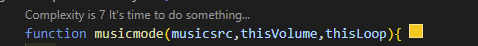

# Getting Start
<p>Using In JavaScript</p>

## Insert `<script>` tag in your `<body>` Element
```html
  <script src="https://cdn.jsdelivr.net/gh/MASTER0811/play-pause-button/main.js"></script>
```
#### OR
```git
  git clone https://github.com/MASTER0811/play-pause-button.git
```

<!-- ## Add New `<script>` Tag
<!-- #### and add a function `musicmode()`
Exp:
```html

``` --> 
## Add a Button
- Only Using This Element `<music-btn>`
Exp:
```html
  <!-- You must add "play" text -->
  <music-btn>Play</music-btn>
```
#### AND
- Add `<script>` tag in your `<body>` Element
- Add a function `musicmode()`
Exp:
```html
<!DOCTYPE html>
<html lang="en">
<head>
    <meta charset="UTF-8">
    <meta http-equiv="X-UA-Compatible" content="IE=edge">
    <meta name="viewport" content="width=device-width, initial-scale=1.0">
    <title>Exp File</title>
</head>
<body>
    <script src="https://cdn.jsdelivr.net/gh/MASTER0811/play-pause-button/main.js"></script>
    <script>
        musicmode()
    </script>
</body>
</html>
```

## About the Function

#### You Can Add `Music` in the First
Exp:
```javascript
    musicmode("./music.mp3")
```
#### You Can Add `Volume` in the Second
Exp:
```javascript
    musicmode("./music.mp3", 0.5)
```
#### You can Add `loop` in the Third
Exp:
```javascript
    musicmode("./music.mp3", 0.5, true)
```
Notice: If you don't want let music loop, you can without any text.

## About the Button `<music-btn>`
You can design using `.style` class
Exp:
```css
  @import url('https://fonts.googleapis.com/css2?family=Poppins:wght@300&display=swap');
  music-btn.style{
      padding: 10px 30px;
      background: lightblue;
      font-size: 18px;
      font-family: 'Poppins',sans-serif;
      font-weight: bold;
  }
```
